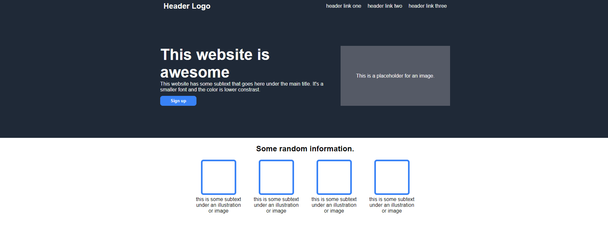
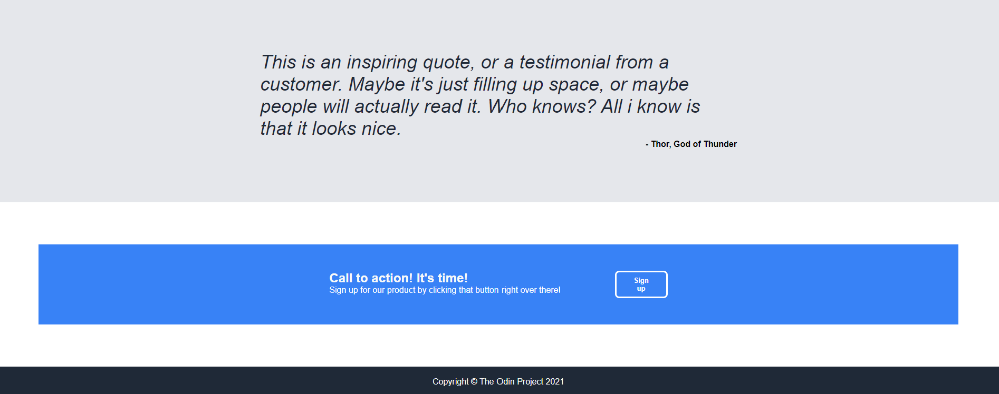

# Introduction

This is the second project from The Odin Project. I need to recreate a web page that looks like this from scratch. I will need to use what I have learnt from sections: HTML Foundations, CSS Foundations and

## Issues
1. White border around `<body>`:
- Used Inspect to check: Margin of 8px present.
2. Used padding instead of setting width.
- Need to make sure container has another container inside to control the width.

There is much to learn. (._.)
Need to try again!

## First attempt

